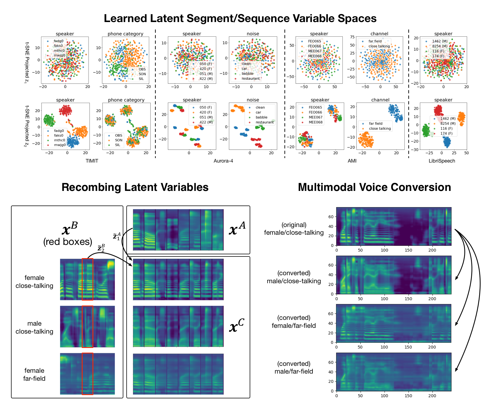

# Scalable Factorized Hierarchical Variational Autoencoders
This repository contains (refactored) codes to reproduce the core results from the two papers:
* [Unsupervised Learning of Disentangled and Interpretable Representations from Sequential Data](https://arxiv.org/abs/1709.07902)
* [Scalable Factorized Hierarchical Variational Autoencoder Training](https://arxiv.org/abs/1804.03201)

Previous version of the codes can be found [here](https://github.com/wnhsu/FactorizedHierarchicalVAE)



If you find the code useful, please cite
```
@inproceedings{hsu2017learning,
  title={Unsupervised Learning of Disentangled and Interpretable Representations from Sequential Data},
  author={Hsu, Wei-Ning and Zhang, Yu and Glass, James},
  booktitle={Advances in Neural Information Processing Systems},
  year={2017},
}
@article{hsu2018scalable,
  title={Scalable Factorized Hierarchical Variational Autoencoder Training},
  author={Hsu, Wei-Ning and Glass, James},
  journal={arXiv preprint arXiv:1804.03201},
  year={2018},
  arxiv={1804.03201},
}
```

# Dependencies
This project uses Python 2.7.6. Before running the code, you have to install
* [Tensorflow 1.0](https://www.tensorflow.org/)
* [Scipy](https://www.scipy.org/)
* [Numpy](http://www.numpy.org/)
* [CFFI](http://cffi.readthedocs.io/en/latest/)
* [Soundfile](https://pysoundfile.readthedocs.io/en/0.9.0/)
* [Matplotlib](http://matplotlib.org/)
* [Scikit-Learn](http://scikit-learn.org/stable/)
* [LibROSA](https://librosa.github.io/librosa/)
* [SPHFile](https://pypi.python.org/pypi/sphfile/1.0.0) (optional, for preprocessing TIMIT raw data)
* [Kaldi](https://github.com/kaldi-asr/kaldi) (optional)
* [Kaldi-Python](https://github.com/janchorowski/kaldi-python/) (optional)

The former 9 dependencies can be installed using pip by running
```
pip install -r requirements.txt
```

The last one requires Kaldi before a specific commit (`d1e1e3b`). If you don't have 
Kaldi before that version, you can install both Kaldi and Kaldi-Python by running
```
make all
```

# Getting Started
Main source codes can be found in `./fhvae/`. `./scripts` contains runable python scripts.
Example scripts for preprocessing are in `./examples/`. 

Two dataset formats are allowed: Kaldi and Numpy.
Dataset should be stored in `./datasets/<dataset_name>/<set_name>/`, where `<set_name>` 
refers to `{train,dev,test}`. Each set folder should contain a `feats.scp` and a `len.scp`.
`*.scp` files follow Kaldi's [script-file](http://kaldi-asr.org/doc/io.html) format, where
each line is:
```
sequence-id value
```
The `value` for `len.scp` is an integer denoting the feature sequence length, 
and the `value` for `feats.scp` is `*.npy` (Numpy format) or `*.ark:<offset>` (Kaldi format).

Such files can be prepared with `./scripts/preprocess/prepare_kaldi_data.py` (Kaldi format) 
or `./scripts/preprocess/prepare_numpy_data.py` (Numpy format), 
given a `wav.scp` file.

Before running any codes, source the environment script first to update `$PYTHONPATH`:
```
. ./env.sh
```

## Preprocessing
We now provide numpy preprocessing recipes for TIMIT and LibriSpeech from a raw data directory
```
python ./examples/prepare_timit_numpy <TIMIT_DIR>	# TIMIT
python ./examples/prepare_librispeech_numpy <LIBRISPEECH_DIR> # LibriSpeech
```
use `-h` to see more options

## Training with Hierarchical Sampling
```
python ./scripts/train/run_hs_train.py --dataset=timit_np_fbank --is_numpy --nmu2=2000
```
Experiments will be saved to `./exp/timit_np_fbank/<exp_name>`.

## Training without Hierarchical Sampling (original FHVAE training)
```
python ./scripts/train/run_train.py --dataset=timit_np_fbank --is_numpy
```
Experiments will be saved to `./exp/timit_np_fbank/<exp_name>`.

## Evaluation
```
python scripts/eval/run_eval.py ./exp/timit_np_fbank/<exp_name> --seqlist=./misc/timit_eval.txt
```
Use `--seqlist` to specify which sequences to use for qualitative evaluation.
Results with be saved to `./exp/timit_np_fbank/<exp_name>/img`.
